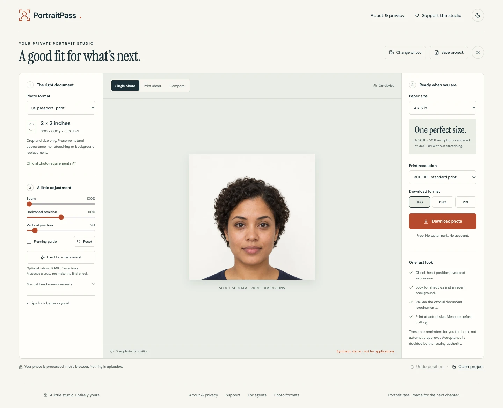

<picture>
  <source media="(prefers-color-scheme: dark)" srcset="docs/screenshots/hero-dark.webp">
  
</picture>

# PortraitPass

**Prepare passport and ID photos privately, with careful framing and accurate print sizes.**

A photographic studio in your browser. Your photo stays on your device. Choose a document, line up the guides, and export an individual photo or a print sheet—without an account, upload, paywall or watermark.

## Try it locally

```sh
pnpm install && pnpm dev
```

Open [the studio](http://localhost:4319). Requires Node.js 24+ and pnpm 11+. This repository is a local build; no public deployment is claimed. `pnpm build` produces a static site in `dist/` for hosting of your choice.

## A little guidance. A better frame.

- **Source-backed print sizes:** US 2×2 inches, UK 35×45 mm, Australia 35×45 mm, plus custom General ID dimensions.
- **Direct control:** drag and zoom, keyboard adjustment, crown/chin/eye guides, original comparison, reset and undo.
- **Print with confidence in the dimensions:** 300 DPI JPEG/PNG (600 DPI available), exact-sized PDF, 4×6 / A4 / US Letter sheets, margins and cut marks. No silent upscaling.
- **Respect the original:** US and UK digital-original modes return the untouched file. They cannot crop, retouch or make print sheets.
- **A separate General ID workspace:** optional on-device background segmentation and custom dimensions. Background replacement is unavailable in passport modes.
- **Portable projects:** save your photo and exact settings in versioned JSON, reopen them in the browser, or hand them to an agent.
- **Human and agent friendly:** the same deterministic geometry powers the studio, CLI and local MCP tools.
- **Considered details:** light and dark themes, mobile layout, local fonts, keyboard labels and useful capture guidance.



The pictured portrait is synthetic demonstration material. Never submit a generated demo photo with an identity application.

## Know what the tool checks

PortraitPass calculates dimensions and helps you frame a photograph. It **does not certify acceptance** or judge identity, likeness, expression, recency or every destination rule. Consult the official guidance linked beside each preset.

Printed and online applications have different requirements. In particular, UK online guidance says not to crop a photo taken on your own device. The digital-original modes preserve the file exactly. Australian guidance requires dye-sublimation glossy prints; inkjet prints are not accepted. Print exported PDFs at **actual size / 100%**, with fit-to-page disabled.

## Privacy

Photo processing runs on your device. There is no backend, analytics, account, API key or remote image service. Fonts and application assets are local. Optional assistance uses local models and offers manual controls. After application assets are loaded, preparation and export work offline.

Photos remain in memory unless you explicitly save a project or download an output. Portable projects contain the original image, including any original metadata; digital-original exports preserve those same bytes. Share these files deliberately. Prepared print exports normalize orientation and include output print metadata.

## For agents

```sh
./scripts/portraitpass presets --json
./scripts/portraitpass inspect --input /path/photo.jpg --json
./scripts/portraitpass sheet --input /path/photo.jpg --preset uk-passport --paper 4x6 --format pdf --output /path/sheet.pdf --json
./scripts/portraitpass project --input /path/photo.jpg --preset uk-passport --embed --output /path/handoff.portraitpass.json --json
./scripts/portraitpass-mcp
```

The direct wrappers keep stdout clean for machine consumers; package-manager lifecycle output can interfere with JSON/stdio. Every CLI operation returns structured JSON. The local stdio MCP server exposes inspect, presets, crop, layout, render, sheet and portable-project tools with input/output schemas. Output paths are explicit, overwrite is opt-in, and source files cannot be overwritten.

See [the agent guide](docs/agent-guide.md) for the versioned project format, source limits, output semantics, MCP configuration and worked examples. Project instructions are in [AGENTS.md](AGENTS.md); the static site includes `llms.txt`.

## Develop and verify

```sh
pnpm typecheck
pnpm test
pnpm test:e2e
pnpm build
```

Core tests parse exported images and PDFs, check all preset/paper combinations and exercise real CLI/MCP processes. Browser verification covers input, positioning, project handoff, original-byte preservation, exports, accessibility and privacy. Use installed Chrome for browser checks; no additional browser download is needed.

`src/core/` is the pure TypeScript geometry/spec/project library. `src/node/` contains Sharp/PDF renderers, CLI and MCP. The browser uses the shared geometry with Canvas. Pixel resampling can differ slightly between engines; physical dimensions and stored project coordinates share one model.

## License and support

Original code is [MIT](LICENSE). Dependency, model, font and demo-asset provenance is recorded in [CREDITS.md](CREDITS.md). Passport dimensions are attributed to their official sources; no government endorsement is implied.

[Support PortraitPass](http://localhost:4319/support/) through the local app’s support page.
