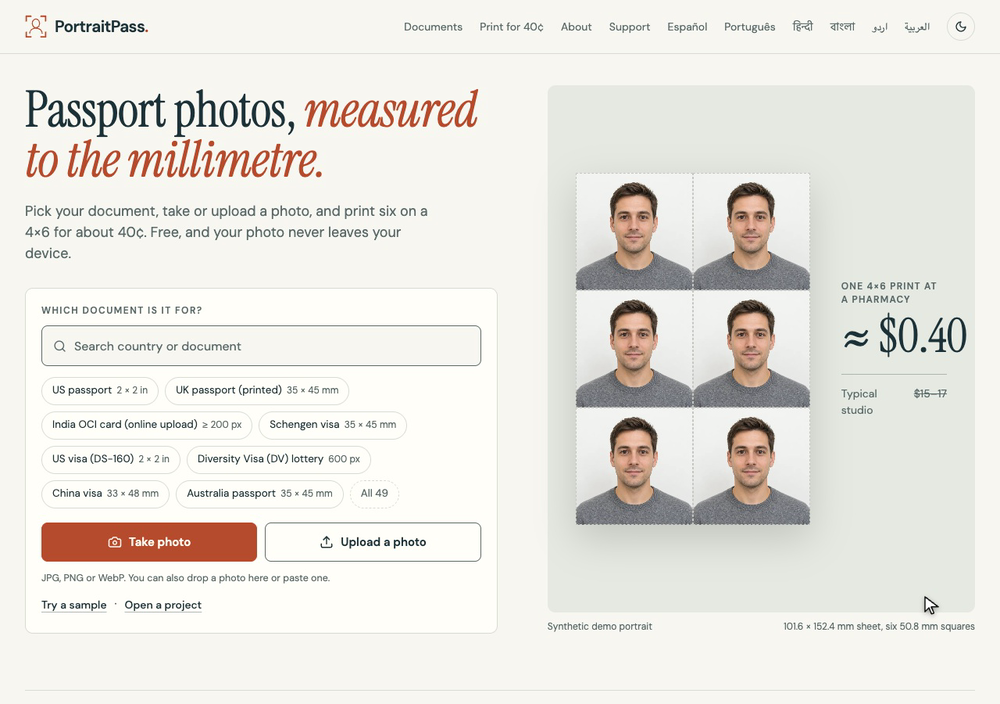

<picture>
  <source media="(prefers-color-scheme: dark)" srcset="docs/screenshots/hero-dark.webp">
  
</picture>

# PortraitPass

**Passport photos, sized exactly. Every measurement shown, your face never edited, 40¢ to print.**

**[Open PortraitPass →](https://portraitpass.vercel.app)** · [All 49 documents](https://portraitpass.vercel.app/documents/) · [Dataset (JSON)](https://portraitpass.vercel.app/data/documents.json)

Free passport photo maker for [US passport 2×2](https://portraitpass.vercel.app/us-passport-photo/), [UK passport 35×45 mm](https://portraitpass.vercel.app/uk-passport-photo/), [Schengen visa](https://portraitpass.vercel.app/schengen-visa-photo/), [DV lottery 600×600](https://portraitpass.vercel.app/dv-lottery-photo/), [India OCI](https://portraitpass.vercel.app/in-oci-photo/) and more, in 7 languages.

PortraitPass is a free, open-source (MIT) photo studio that runs in your browser. Pick a document, add a photo, and it frames the photo to the published size, shows the measurements, and exports a print sheet, a single photo or an upload file. No account, upload, paywall or watermark. Your photo never leaves your device.

PortraitPass is an independent open-source project, not affiliated with or endorsed by any government or passport office. We check sizes and positions; the issuing authority decides acceptance.

The website is the product. The command-line tool and MCP server are small extras so an AI assistant can do the same sizing work on local files. There is no npm package.

## What it does

- **49 documents, each with its source.** Passports, visas, ID and residence cards, a lottery and four exam forms across 22 countries and regions. Every entry links to the issuing authority's own page and shows the date it was last checked. See [the dataset](#the-document-dataset).
- **Auto-framing on your device.** After a one-line notice, face detection runs in your browser and frames the photo to the document's head and eye ranges. Drag, zoom and arrow keys always work, and the face position is never sent anywhere.
- **Live measurements and photo checks.** Head height, eye line, centring and resolution against the document's range, plus measure-only checks for background evenness, shadow and colour, lighting, exposure and sharpness. Each shows its value and the allowed range. A "You check" list covers what software cannot judge: expression, glasses, how recent the photo is.
- **Print six for about 40¢.** A 6-up 4×6 in sheet, edge to edge, ready to order at a pharmacy photo counter (prices vary). Landscape packing fits 8 photos of 35×45 mm on the same paper. A4 and US Letter sheets have cut marks. Output is JPEG, PNG or a PDF at exact physical size.
- **Exact digital uploads.** Export a JPEG at the exact pixel size with the file size inside the form's range, for example 600×600 px at 240 KB or less, or 20 to 50 KB. Where a document wants the untouched camera file (US online renewal, UK online), the original is passed through unchanged.
- **Camera capture with hints.** On a phone or laptop, a live overlay shows the head outline and eye line, with on-device hints for face found, distance, tilt and lighting, and a timer. Nothing is recorded or uploaded.
- **Honest about what you cannot do at home.** 14 of the 49 documents are marked "not DIY" (a photographer, a booth, a certified provider or the office takes the photo). They get an explanation, never a preset.
- **Offline and installable.** After the first visit the site works offline and can be installed as an app. (Offline support is new; the face model is stored the first time face assist runs.)

## What it doesn't do

- **Decide acceptance.** We check sizes and positions; the issuing authority decides acceptance. Photo rules change, so check the source page linked beside each document before you apply.
- **Edit your face.** No retouching, smoothing or reshaping. The only edit on offer is an optional background replacement, which is off by default for documents whose rules forbid altered photos and shows a warning at the toggle. Output with a replaced background carries a metadata note.
- **Judge everything.** Expression, glasses, head coverings, likeness and recency are yours to check against the source rules.
- **Replace a photographer where one is required.** Canada's passport photo, for example, must come from a commercial photographer. German passport and ID photos are digital-only through the authority or a certified provider.
- **Print for you.** Export the sheet and order it at a photo counter.
- **Cover every document.** 49 documents is a start, not a full list. Document pages are available in English, Spanish, Portuguese, Hindi, Bengali, Urdu and Arabic; the studio itself is in English for now.

## Privacy

Your photo never leaves your device. Face detection, framing, background checks and every export run in your browser. There is no account, no cookies, no analytics and no third-party scripts; fonts and models are self-hosted.

The site is hosted on Vercel, which, like any host, logs request data such as IP addresses. That is separate from your photo, which is never sent. Tips go through Stripe and are handled there.

Photos stay in memory unless you save a project or download an output. A project file contains the photo, settings and head positions (set by you or found by face detection), and the background mask only while background replacement is on. The photo keeps its original metadata, and original-file exports preserve the same bytes, so share project files deliberately.

Site pages: `/privacy/`, `/terms/` (provided as is, no warranty), `/accessibility/`, `/about/`, `/support/`.

## Run it locally

```sh
pnpm install && pnpm dev
```

Open http://127.0.0.1:4319. Requires Node.js 24+ and pnpm 11+. `pnpm build` type-checks, builds and prerenders a static site into `dist/` (one page per document, size pages, sitemap) for any static host. The intended public address is https://portraitpass.vercel.app (not deployed yet).

```sh
pnpm typecheck   # tsc --noEmit
pnpm test        # core and Node tests: geometry, dataset, exported files, CLI and MCP processes
pnpm test:e2e    # builds, then Playwright with installed Chrome
```

## For agents

The CLI and MCP server run the same TypeScript core as the browser, on local files, with no network. Use the wrappers, not `pnpm`, so stdout stays clean:

```sh
./scripts/portraitpass presets --json
./scripts/portraitpass inspect --input /path/photo.jpg --preset us-passport --json
./scripts/portraitpass sheet --input /path/photo.jpg --preset uk-passport --paper 4x6 --output /path/sheet.pdf --json
./scripts/portraitpass sheet --input /path/photo.jpg --preset us-passport --paper letter --layout cut-marks --orientation landscape --output /path/letter.pdf --json
./scripts/portraitpass digital --input /path/photo.jpg --preset dv-lottery --width 600 --height 600 --max-kb 240 --kb-bytes 1000 --output /path/dv.jpg --json
./scripts/portraitpass project --input /path/photo.jpg --preset uk-passport --embed --output /path/handoff.portraitpass.json --json
./scripts/portraitpass-mcp
```

**CLI commands:** `presets`, `inspect`, `crop`, `render`, `sheet`, `digital`, `project`, `layout`. Sheet layout flags: `--layout edge-to-edge|cut-marks` (default edge-to-edge on 4×6, cut-marks on A4 and Letter) and `--orientation auto|portrait|landscape` (auto picks the direction that fits more photos). `digital` writes one JPEG at exact `--width` and `--height` pixels inside `--min-kb` to `--max-kb`, searching JPEG quality and never enlarging.

**MCP tools** (stdio, absolute paths only): `portraitpass_presets`, `portraitpass_inspect`, `portraitpass_crop`, `portraitpass_layout`, `portraitpass_render`, `portraitpass_sheet`, `portraitpass_digital`, `portraitpass_project`. Render, sheet and digital results carry `checks` and `warnings`. Head height and eye line are measurements, not blockers.

Any document id from the dataset that can be made at home works as `--preset` or `presetId` (35 of the 49); `presets` still lists only the six original presets. Documents marked not DIY are refused. The measure-only photo analysis is a library function (`analyzePhoto`, and `analyzeFile` in Node), not a CLI or MCP command yet.

Details, schemas, exit codes and MCP configuration are in [docs/agent-guide.md](docs/agent-guide.md). Project instructions are in [AGENTS.md](AGENTS.md); the site serves [llms.txt](public/llms.txt).

## The document dataset

The dataset is the open, MIT-licensed core of the project. It lives in TypeScript files that the site, CLI and MCP all read:

- Types: `src/core/documents.ts` (`DocumentSpec`, exported as `DOCUMENTS`).
- Entries: `src/core/data/us.ts`, `south-asia.ts`, `europe.ts`, `world.ts`.
- Bridge to the studio: `src/core/catalog.ts` (`documentPreset`, `documentDigitalTarget`, `searchDocuments`, `presetForId`).

Each entry records:

| Field | Meaning |
| --- | --- |
| `id`, `name`, `country`, `countryCode`, `kind` | Stable kebab-case id (`us-passport`, `in-oci`, `dv-lottery`), display name, ISO code or `EU`, and passport / visa / id-card / residence / citizenship / lottery / exam-form / other |
| `diy` | `yes` (home photo accepted), `digital-only` (upload only), or `no` (photographer, booth, provider or office); `diyNote` says why or gives the caveat |
| `print` | Size in mm, crown-to-chin range, eye-line range measured up from the bottom edge, copies, paper |
| `digital` | Exact or min/max pixels, KB range and whether a KB is 1000 or 1024 bytes, accepted formats, head and eye ratios, `originalOnly` |
| `background` | Colours in plain words, and `edit`: `forbidden` or `unspecified` (`allowed` is in the schema, unused so far) |
| `rules` | Short plain facts from the source: glasses, expression, recency, head coverings |
| `sources` | URL, title, `checkedAt` (YYYY-MM-DD) and `kind` |
| `searchTerms` | Phrases people search for |

**How specs are sourced.** Numbers come from the issuing authority's own page or form, never from photo-service sites, and each source carries the date it was checked. Some authority sites (for example travel.state.gov) block automated fetches. For those, part of an entry was read from search-result text on the authority's own domain instead of the page itself. Those entries are recorded as such in the maintainer's evidence logs, which are not in this repository, and need a human re-check against the live page. Treat the dataset as a well-sourced starting point, not as a legal record.

**How specs are re-checked.** Rules change. A monthly pass goes through every source URL, compares it with the entry, fixes changed numbers and updates `checkedAt`. Tests in `tests/core/documents.test.ts` guard the structure: unique ids, https sources with dates, ordered ranges, KB units set whenever a limit exists, and no banned claim words in user-facing text. Found something wrong? Open an issue with the source link.

Every document has a prerendered page (for example `/us-passport-photo/`) with the spec table, source and check date.

## Develop

`src/core/` is the pure TypeScript geometry, dataset and project library. `src/node/` holds the Sharp and PDF renderers, the CLI and the MCP server. `src/browser/` and `src/ui/` are the Canvas engine and the React app. Resampling differs slightly between engines; physical sizes and stored project coordinates share one model.

Heavy browser tests use installed Chrome; no extra browser download is needed.

## Licence and support

Code is [MIT](LICENSE). Dependency, model, font and demo-image provenance is in [CREDITS.md](CREDITS.md) and [THIRD_PARTY_NOTICES.md](THIRD_PARTY_NOTICES.md). Document dimensions cite the issuing authority's published guidance by URL; that is attribution, not endorsement.

The demo portraits are synthetic. Never submit a generated demo photo with an application.

Tips are optional and unlock nothing: [support PortraitPass](https://portraitpass.vercel.app/support/).
